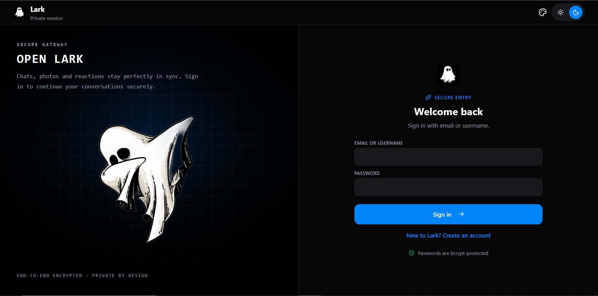
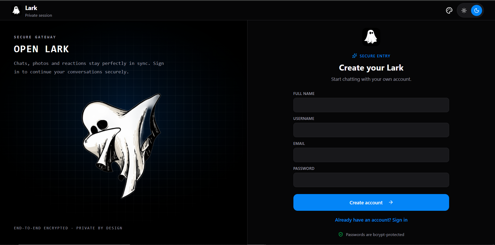
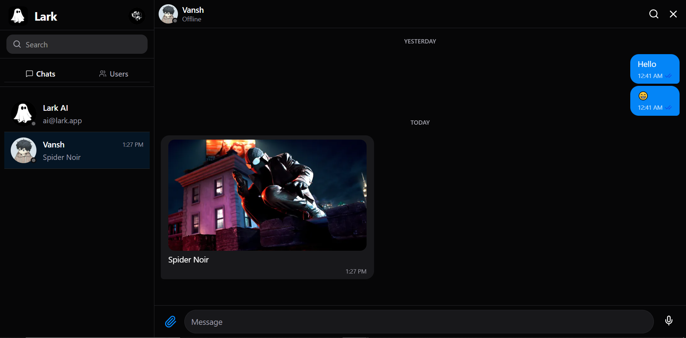
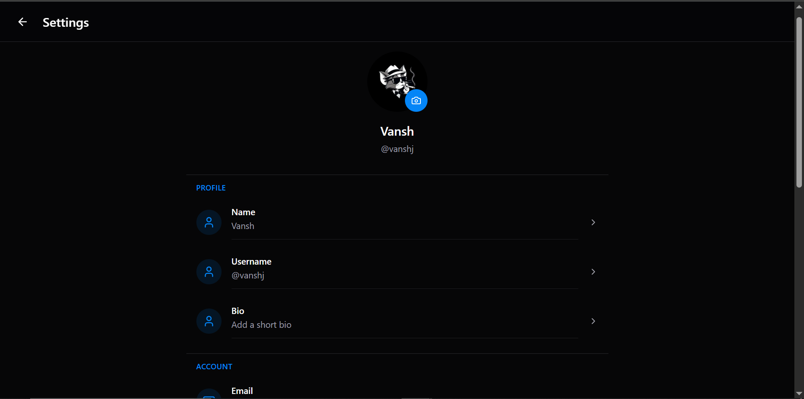
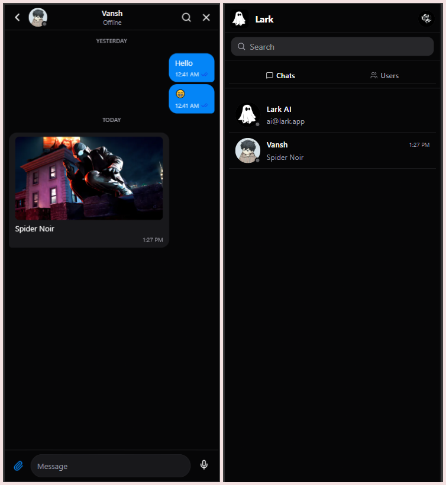

# 🚀 Lark

<div align="center">


<h2>Lark</h2>

A modern full-stack, real-time, human-to-human messaging platform inspired by **WhatsApp**, **Telegram**, and **Messenger**.

</div>

---

# 📖 About

Lark is a modern full-stack messaging application built with the **MERN Stack**. It offers secure authentication, real-time communication, cloud-based media sharing, and a responsive user experience.

The application is designed with a scalable architecture by separating the frontend and backend, making it suitable for production-ready deployment.

---

# 📸 Screenshots

## Login



---

## SignUp



---

## Home



---

## Profile Settings



---

## Mobile View



---

# ✨ Features

- 🔐 JWT Authentication with Email OTP Verification
- 💬 Real-Time One-to-One Messaging
- 📷 Image, Video, Audio & Document Sharing
- ☁️ ImageKit Cloud Storage
- 😀 Emoji Reactions
- ↩️ Reply to Messages
- 📤 Forward Messages
- ✏️ Edit Messages
- 🗑️ Delete for Me / Delete for Everyone
- 📌 Pin & Unpin Messages
- 🟢 Online/Offline Presence
- ⌨️ Real-Time Typing Indicator
- ✅ Read Receipts
- 👤 Profile Management
- 🎨 Light/Dark Mode & Theme Customization
- 📱 Fully Responsive UI
- 🐳 Docker Ready

---

# 🛠 Tech Stack

## Frontend

- React 19
- Vite
- React Router
- Zustand
- Axios
- Socket.IO Client
- Tailwind CSS
- HeroUI
- Lucide React

### Backend

- Node.js
- Express.js
- MongoDB
- Mongoose
- JWT Authentication
- bcrypt
- Socket.IO
- Multer
- ImageKit SDK
- node-cron

---

# 📂 Project Structure

```text
Lark/
│
├── backend/
│   ├── src/
│   │   ├── controllers/
│   │   ├── lib/
│   │   ├── middlewares/
│   │   ├── models/
│   │   ├── routes/
│   │   └── index.js
│   │
│   └── package.json
│
├── frontend/
│   ├── public/
│   ├── src/
│   │   ├── components/
│   │   ├── context/
│   │   ├── data/
│   │   ├── hooks/
│   │   ├── lib/
│   │   ├── pages/
│   │   ├── store/
│   │   ├── styles/
│   │   ├── App.jsx
│   │   ├── main.jsx
│   │   └── index.css
│   │
│   └── package.json
│
├── Dockerfile
├── README.md
└── screenshots/
```

---

# 🚀 Why Lark?

Lark combines the best features of modern messaging platforms into a single application.

- ⚡ Instant real-time messaging using Socket.IO
- 📁 Secure cloud media storage with ImageKit
- 🔐 JWT Authentication with Email OTP
- 🎨 Beautiful and responsive UI
- 🏗️ Clean MERN architecture
- 📱 Mobile-friendly experience
- 🐳 Easy deployment with Docker

---


# ⚙️ Installation

## Prerequisites

Make sure the following are installed on your system:

- Node.js (v20 or later)
- npm
- MongoDB
- Git

---

## Clone the Repository

```bash
git clone https://github.com/vansh-jethwani/Lark.git
cd Lark
```

---

## Backend Setup

```bash
cd backend
npm install
```

Create a `.env` file inside the `backend` folder.

```env
PORT=3000

MONGODB_URI=your_mongodb_connection_string

JWT_SECRET=your_jwt_secret

RESEND_API_KEY=
RESEND_FROM_EMAIL=

CLIENT_URL=http://localhost:5173

IMAGEKIT_PUBLIC_KEY=your_public_key
IMAGEKIT_PRIVATE_KEY=your_private_key
IMAGEKIT_URL_ENDPOINT=your_url_endpoint

# Web Push (generate with: npx web-push generate-vapid-keys)
VAPID_PUBLIC_KEY=
VAPID_PRIVATE_KEY=
VAPID_SUBJECT=mailto:you@example.com

NODE_ENV=development
```

Start the backend server.

```bash
npm run dev
```

Backend runs on:

```
http://localhost:3000
```

---

## Frontend Setup

Open another terminal.

```bash
cd frontend
npm install
```

Create a `.env` file inside the `frontend` folder.

```env
VITE_API_URL=http://localhost:3000/api
```

Start the frontend.

```bash
npm run dev
```

Frontend runs on:

```
http://localhost:5173
```

---

# 🐳 Docker

Build the Docker image:

```bash
docker build -t lark .
```

Run the container:

```bash
docker run -p 3000:3000 --env-file backend/.env lark
```

---

# ☁️ Deployment

| Service | Platform |
|----------|----------|
| Frontend | Vercel |
| Backend | Render |
| Database | MongoDB Atlas |
| Media Storage | ImageKit |

---

# 📜 Available Scripts

## Backend

| Command | Description |
|----------|-------------|
| `npm install` | Install dependencies |
| `npm run dev` | Start development server |
| `npm start` | Start production server |

---

## Frontend

| Command | Description |
|----------|-------------|
| `npm install` | Install dependencies |
| `npm run dev` | Start Vite development server |
| `npm run build` | Build for production |
| `npm run preview` | Preview production build |
| `npm run lint` | Run ESLint |

---

# 🛣️ Roadmap

Planned features for future releases:

- 📞 Voice Calling
- 🎥 Video Calling
- 👥 Group Chats
- 🔍 Message Search
- ⭐ Starred Messages
- 🔐 End-to-End Encryption

---

# 👨‍💻 Author

**Vansh Jethwani**

Computer Science Undergraduate passionate about Full-Stack Development, Backend Engineering, Artificial Intelligence, Cloud Computing, and DevOps.

**GitHub**

```text
https://github.com/vansh-jethwani
```

**Project Repository**

```text
https://github.com/vansh-jethwani/Lark
```

**Project Live Link**

```text
https://lark-rxey.onrender.com/
```

---

# 📄 License

This project is licensed under the **ISC License**.

Feel free to use, modify, and learn from this project for educational purposes.

---

<div align="center">

### ⭐ If you found this project helpful, consider giving it a star!

Made with ❤️ by **Vansh Jethwani**

</div>
